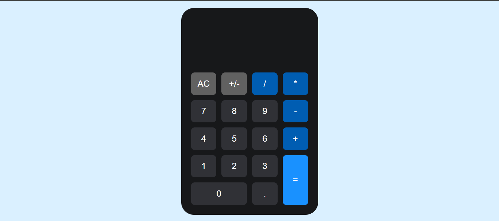
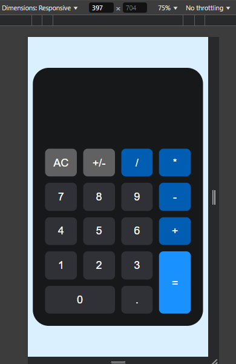

<h1 align="center"> Caluladora - GRID</h1>

### Imagens do projeto

    <strong>Versão Desktop</strong> | <strong>Versão Mobile</strong>

 

  
  

## 🚀 Tecnologias

Esse projeto foi desenvolvido com as seguintes tecnologias:

- HTML
- CSS
- Javascript

## 💻 Projeto

O projeto da calculadora foi desenvolvido com a ideia de praticar o CSS-GRID, utilizando um pouco de javascript para fazer as operações,
mas a logica de programação não foi um foco nesse projeto.

---
